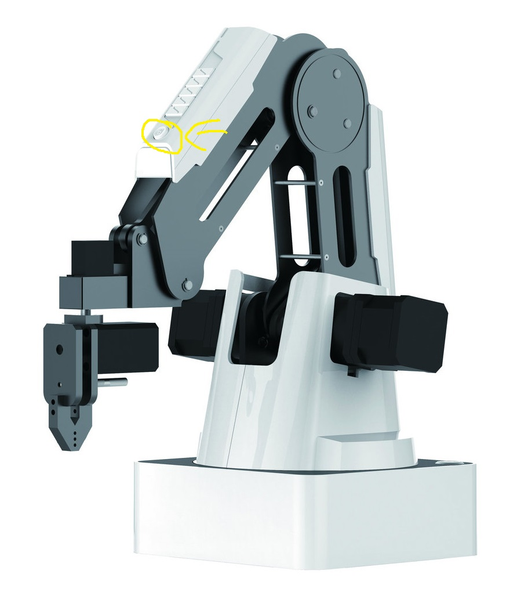

# User Dokumentation - Dobo Daten Visualisierung

## Zweck:

Dieses System dient dazu, während des Messebetriebs Echtzeit-Daten wie Temperatur und Luftfeuchtigkeit zu erfassen und diese Daten über verschiedene Geräte und Softwarekomponenten zu verarbeiten und anzuzeigen. Ziel ist es, diese Informationen benutzerfreundlich auf einer Weboberfläche zu präsentieren.

## Zielgruppe

Dieses System richtet sich an firmen-interne Vertriebsmitarbeiter sowie an Interessenten ohne technisches Spezialwissen, wie beispielsweise Einkäufer anderer Konzerne oder Firmen. Es wurde entwickelt, um diese Benutzer in die Lage zu versetzen, Echtzeit-Daten unkompliziert zu überwachen und zu verstehen.

Diese Dokumentation soll Ihnen helfen, das System erfolgreich zu bedienen und mögliche Probleme schnell zu beheben. Bei weiteren Fragen oder Problemen wenden Sie sich bitte an den technischen Support Ihrer IT-Abteilung.

## Bedienung des Systems

- Navigieren sie auf die Website [VOM ADMIN ANZUGEBEN /dashboard]
- Schauen sie sich die Daten an

## Welche Fehler können auftreten

- Der Dobot macht ein lautes konstantes Knacken?
  - Drücken sie den LockKnopf vom am Dobo um ihn von der Steuerung zu lösen um mögliche Schäden zu vermeiden.
    
  - Trennen sie den Dobo vom Strom und informieren sie ihren Administrator.
- Der Dobot bewegt sich nicht?
  - Überprüfen sie ob die Kabel mit dem Dobo richtig verbunden sind und das die Lampe am Dobo blau leuchtet.
    
- Ist die angegebene Seite nicht zu erreichen?
  - Überprüfen sie ob die URL richtig eingegeben wurde.
    [VOM ADMINISTRATOR ZU ERGÄNZEN]
- Ich sehe auf einmal vier komische Knöpfe anstatt mein Dashboard?
  - Drücken sie auf den Knopf Dashboard um in die gewohnte Ansicht zurück zu kehren
  - 
- Verändern sich die Anzeigen auf der Seite nicht?
  - Drücken sie den Grünen Reconnect Knopf unten rechts
  - 
- Ich bekomme innerhalb einer Minute immernoch keine Daten?
  - Öffnen sie die Konsole mit F12. Sollten dort etwas rotes zu sehen sein melden sie sich bitte bei ihrem Administrator
  - 
- Funktionieren die Server und CLient Verbindungen nicht?
  - Stellen sie sicher das sie sich im selben Netzwerk befinden und die IP-Adresse aktualisieren
